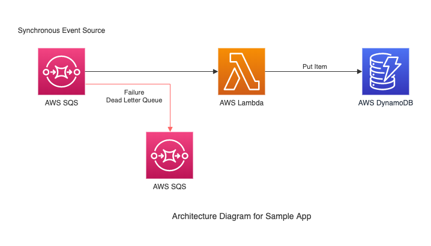

# Lambda Triggers and Destinations Sample (Java)

# Intro
This sample app demonstrates the following Lambda best practices:
1. Use SAM / CloudFormation to create and manage your Lambda functions.
2. Minimize the amount of code you write. In this sample we accomplish this through the
    Lambda Triggers and SQS Dead Letter Queue features.
3. Pack only the dependencies you really need. The pom file includes only the dependencies 
    needed and includes specific parts of the AWS SDK needed instead of the entire SDK.
4. Apply the principle of least privilege which is accomplished through the use of Policy Templates.
5. Use env variables to pass operational parameters to your function. This is accomplished through
    the use of AWS Parameter Store. 
 

The project source includes function code and supporting resources:

- `src/main` - Java function code
- `src/test` - unit tests
- `template.yml` - AWS CloudFormation / SAM template
- `pom.xml` - Maven build file
- `create-bucket.sh`, `build-deploy-stack.sh`, `send-message.sh`, `send-message-multiple-items.sh`, 
    `send-bad-message.sh`, `delete-stack.sh` - scripts to manage the app using the AWS CLI.

# Requirements
- [Java 8/11 SE JRE](https://www.oracle.com/java/technologies/javase-downloads.html)
- [Maven](https://maven.apache.org/docs/history.html)
- [AWS CLI v1](https://docs.aws.amazon.com/cli/latest/userguide/cli-chap-install.html).

# Setup and Deploy
1. Download or clone this repository.
    ~~~~
    # Run the following commands in your terminal
    $ git clone https://github.com/scalabletech/aws-lambda-best-practices-samples.git
    $ cd aws-lambda-best-practices-samples/lambda-sqs-dynamodb-sample
    ~~~~

2. Create a new S3 bucket to store your code.
    ~~~~
    # Run the following command in your terminal
    $ ./create-bucket.sh
    ~~~~
 
3. Build and then deploy the solution to AWS.
    ~~~~
    # Run the following command in your terminal
    $ ./build-deploy.sh
    ~~~~
    

# Test
1. Send a message to the SQS queue which will trigger the Lambda function. This will result in the 
    Lambda function putting an item to the DynamoDB table and returning a successful response.
    ~~~~
    # Run the following command in your terminal
    $ ./send-message.sh
    ~~~~

2. Send a message to the SQS queue with multiple items to persist to the database. This will trigger
    the Lambda function which will batch write multiple items to the DynamoDB table and return a 
    successful response. Two of the items will have temperature readings that are out of range based
    on our app configuration settings stored in AWS Parameter Store and so won't be persisted to 
    DynamoDB.
    ~~~~
    # Run the following command in your terminal
    $ ./send-message-multiple-items.sh
    ~~~~

3. Send a bad message to the SQS queue which will trigger the Lambda function. This bad message 
    will result in the Lambda function returning an error. The error state will cause the message to 
    be retried. After the configured number of retries are exhausted the message will be sent to the 
    dead letter queue which is an SQS queue setup to receive failed messages.
    ~~~~
    # Run the following command in your terminal
    $ ./send-bad-message.sh
    ~~~~

# Cleanup
1. To avoid future charges, delete the CloudFormation stack when you're done working with it.
    ~~~~    
    # Run the following command in your terminal
    $ ./delete-stack.sh
    ~~~~
