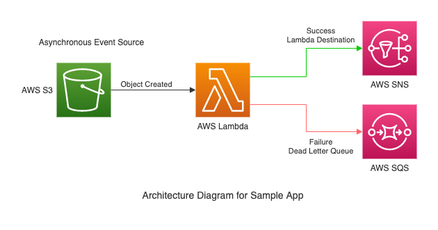

# Lambda Triggers and Destinations Sample (Java)

# Intro
This sample app demonstrates the following Lambda best practices:
1. Use SAM / CloudFormation to create and manage your Lambda functions.
2. Minimize the amount of code you write. In this sample we accomplish this through the
 Lambda Triggers, Destinations and Dead Letter Queue features. 

This sample app is featured in the article 
[Best Practices for Running Serverless Code in AWS Lambda - Part 1](https://www.scalabletech.com/blog/best-practices-for-running-serverless-code-in-aws-lambda-part-1/).
It was also demoed in a 
[Meetup event](https://www.meetup.com/South-Florida-AWS-User-Group/events/271338920/)
 for the [South Florida AWS User Group](https://www.meetup.com/South-Florida-AWS-User-Group).

The project source includes function code and supporting resources:

- `src/main` - Java function code
- `src/test` - unit tests
- `template.yml` - AWS CloudFormation / SAM template
- `pom.xml` - Maven build file
- `create-bucket.sh`, `build-deploy-stack.sh`, `upload-image.sh`, `upload-zip.sh`, `delete-stack.sh` - 
    scripts to manage the app using the AWS CLI.

# Requirements
- [Java 8/11 SE JRE](https://www.oracle.com/java/technologies/javase-downloads.html)
- [Maven](https://maven.apache.org/docs/history.html)
- [AWS CLI v1](https://docs.aws.amazon.com/cli/latest/userguide/cli-chap-install.html).

# Setup and Deploy
1. Download or clone this repository.
    ~~~~
    # Run the following commands in your terminal
    $ git clone https://github.com/scalabletech/aws-lambda-best-practices-samples.git
    $ cd aws-lambda-best-practices-samples/lambda-trigger-destinations-sample
    ~~~~

2. Create a new S3 bucket to store your code.
    ~~~~
    # Run the following command in your terminal
    $ ./create-bucket.sh
    ~~~~
 
3. Build and deploy the solution to AWS.
    ~~~~
    # Run the following command in your terminal
    $ ./build-deploy.sh
    ~~~~
    

# Test
1. Upload an image file to the application S3 bucket and trigger the Lambda function. This will 
    result in the Lambda function returning a successful response. The success state will cause a 
    message to be sent to the Lambda destination SNS Topic setup to receive notifications for 
    successful transactions.
    ~~~~
    # Run the following command in your terminal
    $ ./upload-image.sh
    ~~~~

2. Upload a zip file to the application S3 bucket and trigger the Lambda function. This will result 
    in the Lambda function returning an error. The error state will cause the Lambda function call 
    to be retried. After the configured number of retries are exhausted the message will be sent to 
    the dead letter queue which is an SQS queue setup to receive failed messages.
    ~~~~
    # Run the following command in your terminal
    $ ./upload-zip.sh
    ~~~~

# Cleanup
1. To avoid future charges, delete the CloudFormation stack when you're done working with it.
    ~~~~    
    # Run the following command in your terminal
    $ ./delete-stack.sh
    ~~~~
